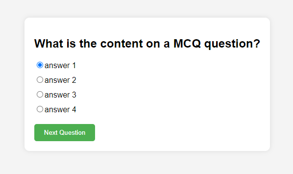
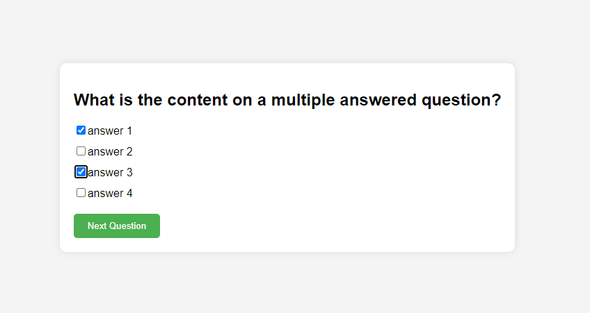
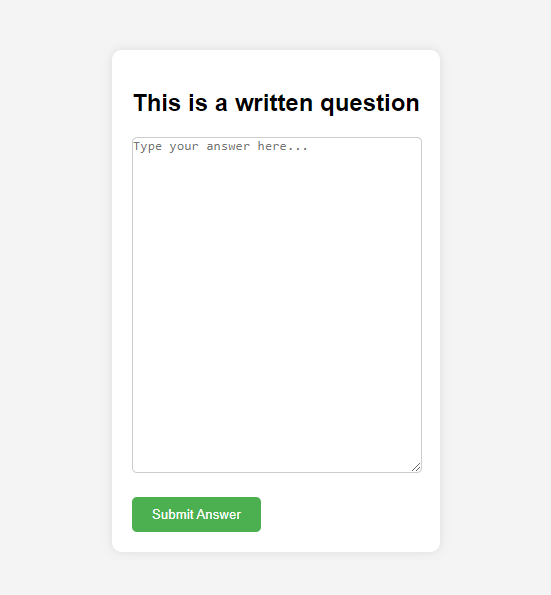
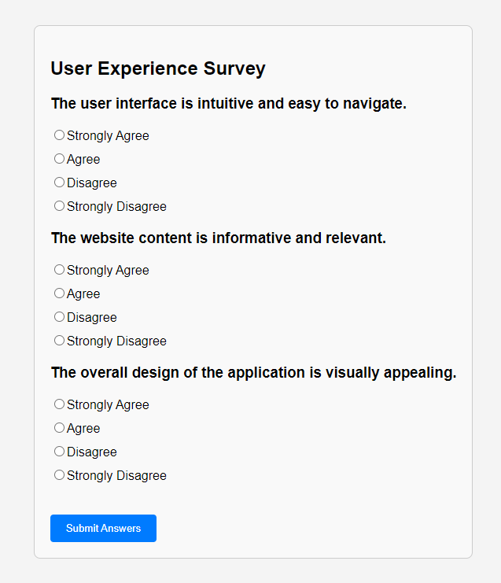

# Survey Template

## Purpose of the Project
The purpose of this project is to create a survey template that includes four common types of questions. This template can be easily customized by users to implement in their forms.

## Question Types
1. **Single Choice MCQ**

   

2. **Multiple Choice MCQ**

   

3. **Written**

   

4. **Likert Scale Questions**

   

## Completed
- Question formats have been developed for each question type.

## Further Development
- Implementing an instance of answering questions.
- Interfacing the frontend with Firebase tabular dataframe.

